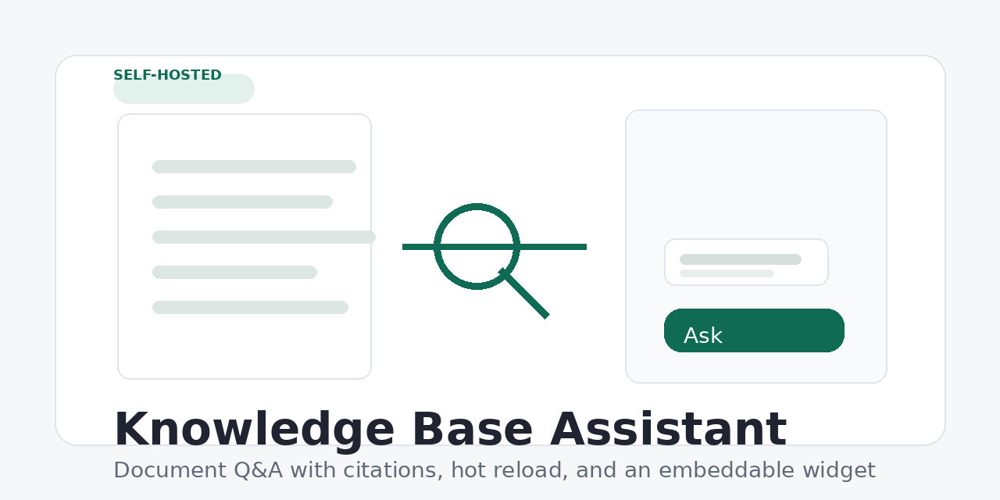

# Knowledge Base Assistant

[中文](README.zh-CN.md)

[](https://github.com/xyh-wiki/rag-support-bot/actions/workflows/ci.yml)

Live demo: https://bot.xyh.wiki



Self-hosted document Q&A for product docs, internal manuals, policies, and
support content. It indexes local files, retrieves relevant sections, and
streams answers with citations.

Supported files: Markdown, text, PDF, Word (`.docx`), Excel (`.xlsx`), and HTML.

## What it does

- Parses documents into section-level chunks.
- Builds an in-memory BM25 index; no vector database is required.
- Watches the document directory and reloads the index when files change.
- Streams responses over Server-Sent Events.
- Shows source citations before the answer.
- Falls back to source-only mode when no completion API key is configured.
- Provides a floating assistant for the built-in showcase page.

## Quick Start

Python:

```bash
pip install -r requirements.txt
cp .env.example .env
export OPENAI_API_KEY=sk-...
uvicorn app:app --reload
```

Docker Compose:

```bash
cp .env.example .env
docker compose up --build
```

Open `http://localhost:8000`.

If `OPENAI_API_KEY` is not set, the service still works as a searchable source
viewer: it returns the most relevant excerpts and citations, but does not
synthesize an answer.

## Configuration

| Variable | Purpose | Default |
|---|---|---|
| `OPENAI_API_KEY` | Key for answer generation | unset |
| `OPENAI_BASE_URL` | OpenAI-compatible endpoint | official API |
| `MODEL` | Model used for generation | `gpt-5.4` |
| `TOP_K` | Chunks retrieved per question | `4` |
| `RATE_LIMIT_PER_MIN` | Per-IP chat requests per minute | `30` |
| `BOT_NAME` | Product name shown in the UI and default prompt | `Knowledge Base` |
| `BOT_TAGLINE` | Subtitle shown in the UI | sample text |
| `BOT_PLACEHOLDER` | Input placeholder text | sample text |
| `BOT_LANG` | UI language (`en`, `zh-CN`, ...) | `en` |
| `PUBLIC_ORIGIN` | Sole showcase origin allowed to call the chat endpoint | current request origin |
| `DOCS_DIR` | Knowledge-base directory | `docs/` |
| `SYSTEM_PROMPT_FILE` | Path to a custom system prompt | built-in prompt |
| `SHOW_KB_PANEL` | Show loaded documents in the UI | `false` |
| `SHOW_SOURCES` | Send and display document source labels and ask the model for citations | `true` |

## Access Restrictions

This service is a same-origin product showcase. It does not support cross-origin
embedding or third-party API integrations. `POST /api/chat` validates `Origin`
and browser Fetch Metadata; missing-origin and cross-site requests receive HTTP
403. Set `PUBLIC_ORIGIN` to the canonical showcase URL in production. Per-IP
rate limiting still applies through `RATE_LIMIT_PER_MIN`.

## Internal HTTP Endpoints

`POST /api/chat`

```json
{
  "message": "How do I reset my password?",
  "history": []
}
```

The response is an SSE stream:

- `sources`: list of source labels when `SHOW_SOURCES=true`
- `token`: streamed answer text
- `done`: end of stream

Other endpoints:

- `GET /api/config`
- `GET /api/health`
- `GET /api/kb` when `SHOW_KB_PANEL=true`

## Use Cases

- Customer support knowledge bases
- Internal documentation search
- Policy and compliance Q&A
- PDF, Word, and Excel document search
- Standalone product knowledge-base demonstrations

More notes: `docs-public/use-cases.md`.

## How It Works

1. `rag/ingest.py` loads files and splits them by document structure:
   headings for Markdown/HTML/Word, pages for PDF, sheets and rows for Excel.
2. `rag/retriever.py` tokenizes chunks and builds a BM25 index. CJK text is
   indexed with character bigrams.
3. `rag/index.py` fingerprints the document directory and rebuilds the index in
   the background when files change.
4. `app.py` retrieves the top matching chunks for each question, adds them to
   the prompt, and streams the generated answer.
5. `static/widget.js` and `static/widget.css` render the same-origin browser assistant
   and consume the SSE stream.

For larger corpora, the retriever can be replaced with a vector search backend
without changing the ingestion or HTTP layers.

## Production Updates

Keep the source checkout, runtime deployment, and knowledge-base documents in
separate directories. For each release:

1. Pull the reviewed source revision and install dependencies in the service's
   virtual environment.
2. Synchronize application and static assets, including both `widget.js` and
   `widget.css`.
3. Restart the service, then verify `/api/health`, `/api/config`, the page assets,
   and one real same-origin chat request through the public reverse proxy.
4. Update the static asset version parameters, then hard-refresh the showcase
   page so cached assets cannot hide a bad rollout.

Treat the configured `DOCS_DIR` as the canonical knowledge base. Add or replace
documents there instead of editing generated index data. The service detects
document fingerprints and rebuilds the in-memory index automatically; verify a
changed fact with a real question after every documentation update. Keep
product-version details in the documents themselves and update or remove stale
pages during each product release.

## Development

```bash
python3 -m pytest tests/ -q
node --check static/widget.js
python3 -m pytest tests/test_widget_assets.py -q
```

Docker files are included for deployment:

- `Dockerfile`
- `docker-compose.yml`
- `.dockerignore`

## License

MIT
